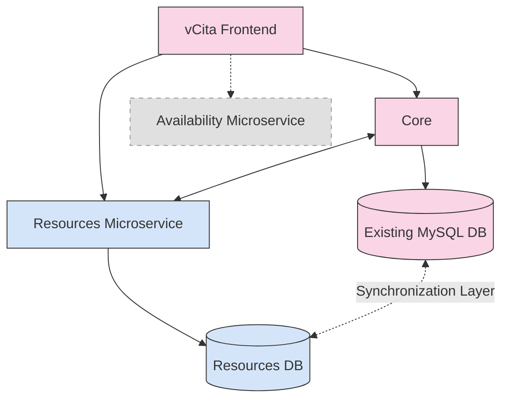
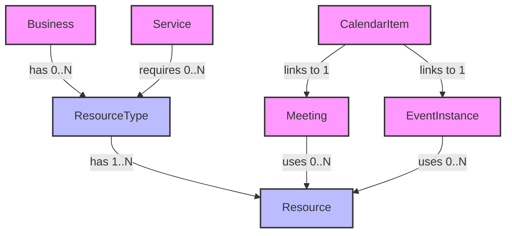
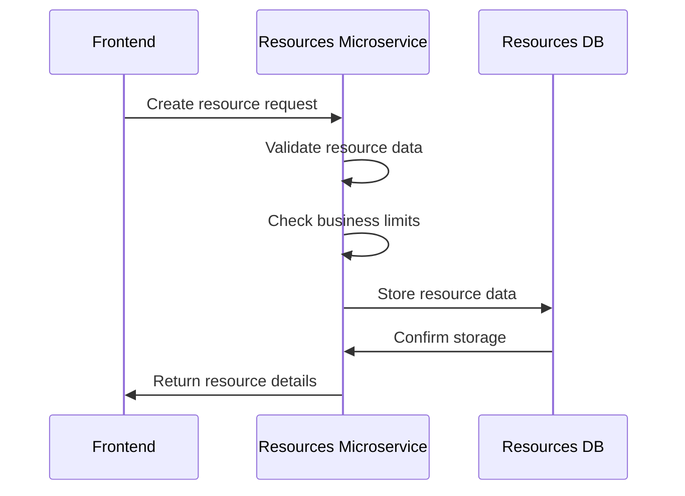
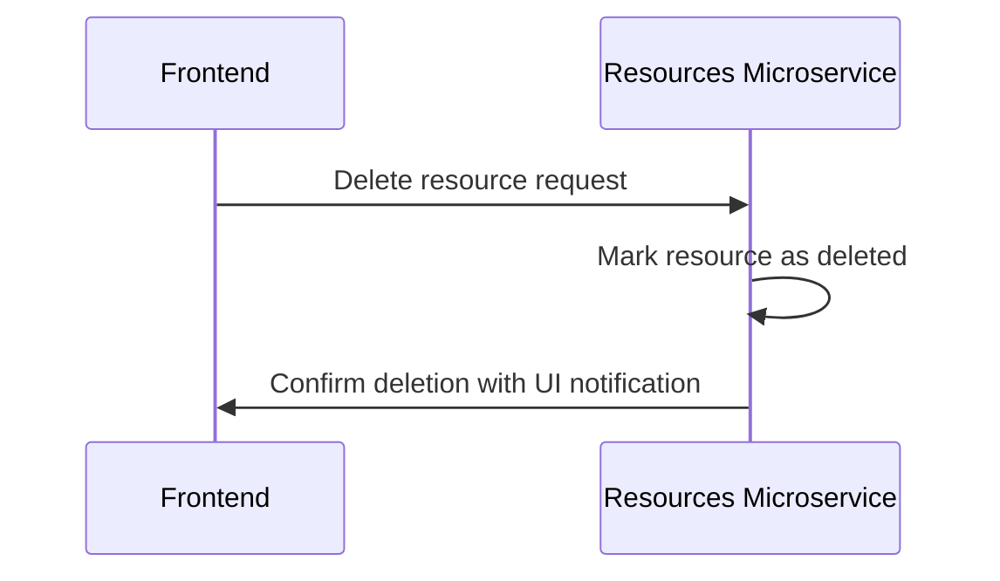
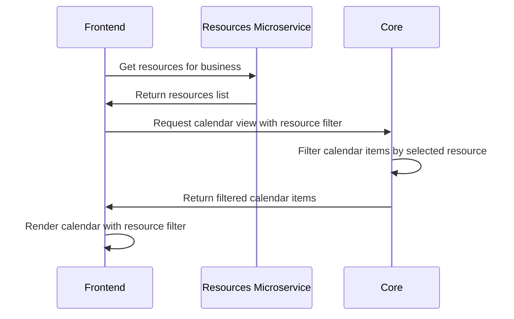
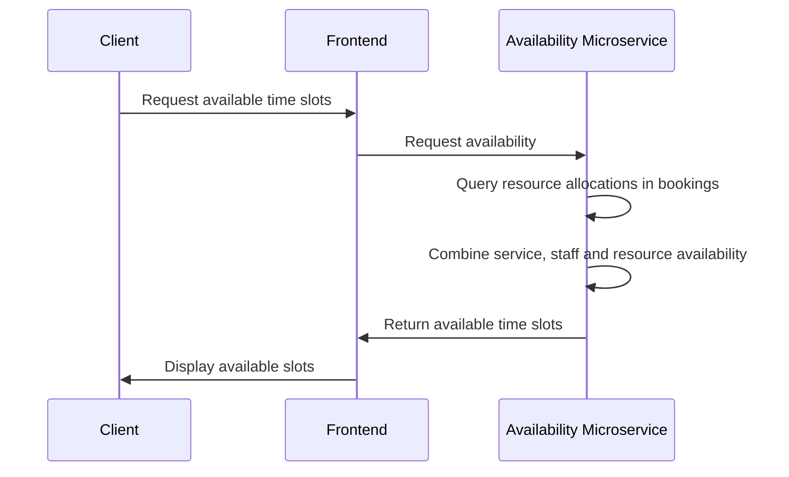
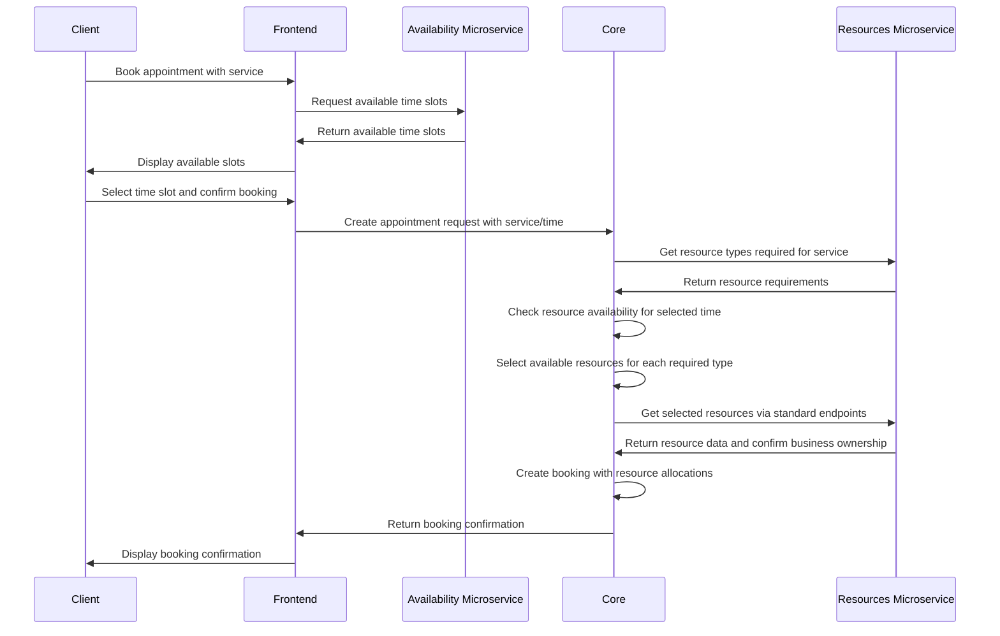
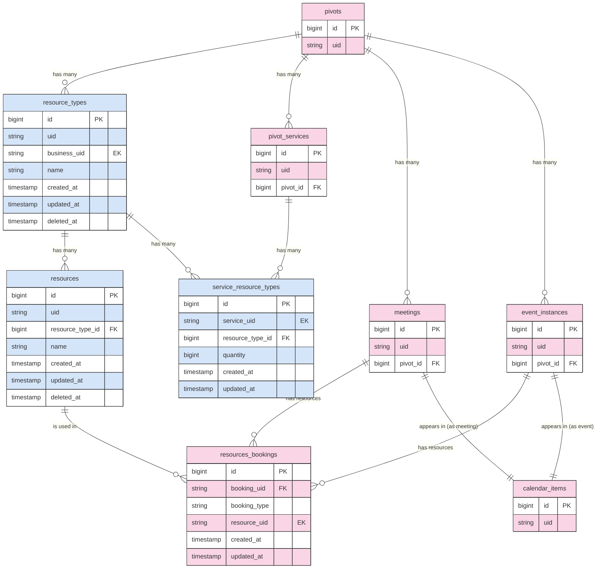

# Resources Feature - High-Level Design Document

# Project Overview

## Background

SMBs often need to manage both staff and physical resources as part of their daily operations. This feature aims to help streamline their processes and prevent overbooking. By introducing a new resource entity within the system, businesses can associate resources with specific services, ensuring they have the necessary equipment or spaces to deliver an optimal service experience.

A typical example is a chair in a hair salon that needs to be allocated for a haircut. While the chair's specific properties may not matter, its availability is essential, as the service cannot be performed without it.

In addition, the resources feature is required to fill product gaps for a Local Search partnership.

## Motivation

The **Resources** feature addresses a key functionality gap identified by our partner, Local Search, and supports broader partner enablement—particularly for those targeting the beauty and wellness verticals. By enabling SMBs to manage shared assets such as equipment or dedicated spaces, this feature helps prevent overbooking and streamline day-to-day operations.

Introducing this capability strengthens vcita's positioning as a comprehensive SMB solution, expanding our value proposition across industries like beauty & personal care, sports & wellness, medical services, and automotive services—where efficient resource allocation is essential for service delivery and business growth.

## Key Objectives
- **Resource Management**: Enable businesses to create, edit, and delete both resource types and resources 
- **Service Association**: Allow linking resources to services that require them
- **Availability Integration**: Include resource availability when scheduling appointments and events
- **Conflict Prevention**: Prevent double-booking of resources through real-time tracking
- **Booking Visibility**: Show which resources are used in appointments and events
- **Reassignment Capability**: Allow changing resources for existing bookings when needed
- **Calendar Management**: Add resource filtering to calendar views for better scheduling

## Basic Assumptions

The Resources feature is designed with these fundamental assumptions:

1. **Resource Availability**: Resources cannot block time independently - their availability is determined by service and staff availability combined.

2. **Operation Hours**: Resources don't have their own operation hours - they follow service and staff hours.

3. **Multiple Resources**: A meeting or event can be linked to multiple resources simultaneously. Conceptually, services can require multiple resources of the same type (e.g., two massage tables for a couple's massage).

4. **Resource Hierarchy**: All resources must belong to a resource type, establishing a two-level hierarchy.

5. **Service Relationship**: Resource types (not individual resources) are associated with services.

6. **Soft Deletion**: Resources and resource types are soft-deleted rather than permanently removed.

7. **Staff Association**: Resources can only be used in conjunction with staff members and cannot be rented or booked independently.

8. **Multi-booking Support**: The Resources feature is designed to work with multi-booking functionality. Each service within a multi-booking can require different resources, and the system will handle resource allocation and availability checks appropriately for each individual service in the booking.

9. **Recurring Appointments**: For recurring appointments, resource availability will only be validated for the first instance, following the same approach used for staff availability. This means that subsequent recurring instances might face resource conflicts, which would need to be manually resolved.

## Not in Scope

### Resource Management
- Resource maintenance mode (temporarily deactivating/reactivating resources)
- Resource priority allocation
- Multiple locations support
- Capacity validation
- Side effects from resource deletion (e.g., sending an email to staff notifying that the associated resource has been deleted)
- Ability to add multiple resources of the same type to a service

### Booking & Scheduling
- Webhooks support for resource creation, updates, and deletion

### User Interface & Client Experience
- Client Portal does not display any specific resource information to clients
- No resource details are included in client notifications (emails, reminders, bubbles)
- Appointment list export is in scope, including columns for resources used in CSV/Excel exports
- No filtering in appointment lists by resources

### Integration
- The old services API will not return data on required resources (additional call to the new resources API is needed to get the service resource definition)
- Extending existing APIs (services, meetings) to include resource information
- Indexing of resources in Elasticsearch

# Glossary

- **Resource**: (UI convention: "Resource Item") A physical asset that a business uses to deliver services (e.g., room, equipment, chair, station). Resources can be assigned to appointments and events.

- **Resource Type**: (UI convention: "Resource") A category of similar resources that share common characteristics and serve the same purpose (e.g., "Treatment Room", "Massage Table").

- **Service Resource Type**: An association between a service and a resource type, indicating that the service requires resources of that type.

- **Resource Allocation**: The process of assigning resources to specific appointments or events based on service availability. Resource allocation is constrained by both staff availability and service requirements. Resources can only be allocated when the required staff is also available for the appointment or event.

- **Resource Availability**: Resources are available 24h. A resource is unavailable when there is an appointment/event that the specific resource is allocated to. Resources can only be available (active) or deleted; temporary deactivation is not supported.

# User Experience

## Mockups
[Figma designs](https://www.figma.com/design/9S1fo3IEkC4VkyxWMpgxui/BO-Resources?node-id=300-6153&p=f&t=XR1rx7vOWkSqLmEk-0)

## Back-Office

The Back-Office provides resource management for businesses:

**Management & Configuration**
- Create, edit, and delete resource types and resources with system-wide limits
- Link resource types to services that require them
- Allocate a resource to appointments and events
- Reassign a resource for appointments and events
- Cancel resource allocation for appointments without canceling the entire appointment
- Filter calendar view by resources for efficient scheduling

**Visibility**
- View which resources are allocated to which appointments/events
- See resource requirements for each service
- Monitor resource usage across the business calendar

**Deletion & Availability**
- Resources can be marked as deleted rather than permanently removed from the system
- When a resource type is deleted, all its resources are automatically marked as deleted
- Resources can be deleted even if scheduled for future bookings
- The UI will indicate that a resource is "deleted" for future appointments/events with options to reassign/remove
- A generic message will notify users that any future appointments using the deleted resource will require manual reassignment
- Past appointments preserve their resource information even after resources are deleted

## Client Portal

The Client Portal provides a streamlined experience for clients interacting with resource-enabled services:

**Booking & Visibility**
- Time slots filtered by staff, service, and resource availability
- Transparent resource allocation without manual selection
- No resource information in client notifications (initial release)

## User Flows

### Back-Office Flows

1. **Create Meeting/Event with Resources**
   - Staff selects client and service that requires resources
   - Staff selects time slot
   - System identifies required resource types
   - Staff selects specific resources from available options
   - Staff confirms booking
   - System allocates resources and creates booking records

2. **Reschedule Meeting/Event with Resources**
   - Staff opens existing meeting
   - Staff selects new time/date
   - System checks resource availability for new time
   - If resources available, meeting is rescheduled
   - If resources unavailable, staff is asked to select different resources or time

3. **Cancel Meeting with Resources**
   - Staff selects meeting to cancel
   - Staff confirms cancellation
   - System releases allocated resources
   - Resources become available for other bookings

4. **Service with Resources is Deleted**
   - Staff attempts to delete service with associated resources
   - System warns about impact on future bookings
   - If confirmed, service is deleted
   - Resource types remain but are no longer associated with deleted service

5. **Calendar View with Resource Filtering**
   - Staff opens calendar view
   - Staff selects resource filter option
   - Staff chooses specific resource to filter by
   - System displays only appointments/events using the selected resource
   - Staff can toggle between different resources or clear filter
   - Calendar updates in real-time based on selected filter

### Client Portal Flows

1. **Book Appointment**
   - Client selects service that requires resources
   - System only displays time slots where both staff and required resources are available
   - Client selects time slot and confirms booking
   - System automatically allocates resources (client doesn't select specific resources)

2. **Client Reschedules Appointment**
   - Client selects existing appointment to reschedule
   - System shows available slots based on both staff and resource availability
   - Client selects new time slot
   - System automatically reallocates resources for new time

3. **Client Requests Meeting**
   - Client submits meeting request for service requiring resources
   - Staff receives notification and checks resource availability
   - Staff confirms booking with resource allocation
   - Client is notified of confirmed appointment

4. **Client Cancels Appointment**
   - Client selects appointment to cancel
   - Client confirms cancellation
   - System automatically releases allocated resources
   - Resources become available for other bookings

# Proposed Solution

## Resource Structure

The Resources feature will utilize a two-level hierarchy with resource types and resources:

1. Resource Types - Categories of resources that share similar characteristics (e.g., "Treatment Room", "Massage Table")
2. Resources - Individual resources belonging to a type (e.g., "Treatment Room 1", "Treatment Room 2")

### Common Questions About Resources

- **Will every service have 1 resource type?**
  No. Services can have zero, one, or multiple resource types. For example, a haircut service might require both a chair and styling tools, while a simple consultation might require no resources. Each business is limited to a maximum of 5 resource types.

- **How many resources can belong to a type?**
  Multiple resources can belong to a single resource type. For example, a salon might have 5 chairs of the same type. Each business is limited to a maximum of 10 resources per resource type.

- **Can a service require multiple resources of the same type?**
  Conceptually, yes. The database schema includes a `quantity` field in the service_resource_types table to support this functionality. However, in the current implementation, this capability is not exposed in the REST API or business entities. Services are currently limited to requiring at most one resource of each type.

- **Can a booking use multiple resources of the same type?**
  No. A booking can use at most one resource of each type. This ensures clarity in resource allocation and prevents confusion.

- **Can a resource be used in multiple appointments at the same time?**
  Yes, in the Back-Office. No, from the Client Portal. The system will prevent double-booking of resources to ensure they are not allocated to overlapping appointments when booked through the Client Portal.

- **How does resource allocation work with multiple service providers?**
  Resources are allocated independently of service providers. The same resource can be used by different staff members at different times.

- **Can resource types and resources be deleted?**
  Yes, both can be soft-deleted (using deleted_at timestamp). The system will handle existing appointments that reference deleted resources.

## Business Rules and Constraints

1. **Resource Type Limits**: Each business is limited to a maximum of 5 resource types.

2. **Resource Limits**: Each business is limited to 10 resources per resource type.

3. **Resource Availability**: Resources can only be available (active) or deleted. Temporary deactivation is not supported in the initial implementation.

4. **Resource Hierarchy**: Resources must belong to a resource type.

5. **Double-booking Prevention**: Resources cannot be double-booked through the Client Portal, but staff can override this restriction in the Back-Office.

6. **Resource Deletion Rules**: System warns when deleting resources that are scheduled for future bookings, but allows deletion while maintaining existing bookings. The UI indicates deleted resources in future appointments with reassignment options.

7. **Multiple Resources per Meeting**: A meeting can use multiple resources simultaneously, but only one resource of each type (e.g., one room and one table, but not two rooms).

8. **Service Resource Requirements**: Services define which resource types they need, not specific resources. Resource selection happens during booking.

## Permission Controls

A new permission will be introduced to control access to resource management functionality:
- **can_manage_resources**: This permission will determine whether a staff member can create, edit, and delete resource types and resources.

## High-Level Architecture

The Resources feature will be implemented as a dedicated microservice with its own database, following a modern microservices architecture approach. For detailed information about the architectural considerations and rationale, see the [Resources HLD Considerations document](resources-hld-considerations.md).

## Key Components

- **Resources Microservice**: Nest.js service handling resource management and allocation logic
- **Resources Database**: Dedicated database for resource data
- **Core**: Existing Ruby on Rails application for appointment and event management
- **Core Database**: Existing MySQL database storing booking and business data
- **Frontend**: Vue-based UI in the `frontage` repository
- **Synchronization Layer**: Ensures data consistency between services (will be developed at a later stage, awaiting architectural decisions and generic solution for all vCita microservice architecture)
- **Availability Microservice**: Future service for managing availability of resources (will be developed at a later stage and is not part of this HLD). This is treated as a black box in the current architecture.

## Communication Patterns

Communication between components will follow REST API patterns with feature flag controls for gradual rollout. The Resources microservice will:
- Expose RESTful endpoints for resource management operations
- Implement feature flag controls to manage feature visibility

The Resources microservice and Core have a relationship using synchronous HTTP requests:
- Core communicates with Resources to verify resource existence and ownership
- All operations between Core and Resources are synchronous, ensuring immediate data consistency
- This communication ensures Core can properly enforce booking rules and prevent invalid resource allocations

## Data Consistency Strategy

The Resources microservice and Core will maintain clear domain boundaries:

- Core will be responsible for managing all booking data and availability tracking in its own database
- Resources microservice will only manage resource types and resources data
- Core will query Resources microservice to verify resource existence and business ownership
- Resources microservice does not track or store any time-related data
- Resources microservice has no knowledge of bookings or availability
- This approach reduces the need for complex synchronization between services for booking data

## System Components

### Resources Microservice Components

1. **Resource Management Module**
   - Handles CRUD operations for resource types and resources
   - Enforces business rules, validations, and resource limits
   - Manages feature flag controls

2. **Resources API Layer**
   - Provides RESTful endpoints for resource management
   - Handles connection between resource types and services
   - Implements authentication and authorization
   - Provides resource verification through standard GET endpoints

3. **Resources Database Layer**
   - Manages persistent storage of resource data
   - Implements optimal indexing for queries

### Core Components

1. **Resource Allocation Engine**
   - Manages booking data related to resources
   - Handles availability checks and conflict prevention

2. **Booking API Layer**
   - Extends booking APIs to support resource parameters
   - Checks resource availability without modifying response formats
   - Validates resource parameters during booking

3. **Core Database Layer**
   - Stores booking-resource association data
   - Maintains efficient resource availability queries

### Cross-Service Components

1. **Synchronization Service**
   - Ensures data consistency between services
   - Will be developed at a later stage as part of broader microservice architecture

## Data Model

### Entity Relationships

## Resource Processes

### Resource / Resource Type Creation

### Resource Deletion

Note: When a resource is deleted, the system maintains existing bookings that reference the deleted resource. The UI will display appropriate indicators and offer reassignment options for future bookings that contain deleted resources. Deleting a resource will always trigger a confirmation notification in the UI; no additional checks or updates to Core are needed.

### Calendar View with Resource Filtering

### Resource Availability Determination

### Resource Allocation and Booking

Note: When bookings are made through the Client Portal, the system prevents double-booking of resources by only displaying time slots where resources are available. In the Back-Office, staff can override this restriction and create overlapping bookings if necessary, though they will receive warning messages.

# Integration Points

The Resources microservice will integrate with existing systems through the following touchpoints:

1. **Core Integration**
   - REST API endpoints for resource verification through standard GET endpoints
   - Resources microservice provides resource data through standard CRUD operations
   - Core manages all resource booking data and availability checks in `resources_bookings` table
   - Core handles all time-related aspects of resource allocation
   - Existing Core APIs will be modified to support resource allocation and availability

2. **Frontend Integration**
   - Vue components will consume Resources microservice APIs directly
   - Feature flag controls resource visibility in service settings and booking flows
   - Resource filtering in calendar views via dedicated endpoints

3. **Database Integration**
   - Resources microservice uses its own dedicated database
   - Separate schema for resource tables
   - No direct database connections between Core and Resources

4. **Authentication/Authorization**
   - Leverages existing vCita authentication mechanisms
   - Permission checks via Core's existing business/staff permission models

# Detailed Design

## Backend Services

### Entity Briefs

The Resources microservice will expose the following v3 entities through its API.

#### ResourceType

| Item | Value | Instructions |
|------|-------|-------------|
| Entity Name | ResourceType | The category of resources that a business can define |
| Description | A category of similar resources that share common characteristics and serve the same purpose | |
| Domain | Scheduling | |

Properties

| Name | Type | Format | Summary | Comments |
|------|------|--------|---------|----------|
| uid | string | | The entity's unique identifier | System-generated unique ID |
| created_at | string | date-time | Creation date and time | ISO 8601 format |
| updated_at | string | date-time | Last update date and time | ISO 8601 format |
| name | string | | The name of the resource type | E.g., "Treatment Room", "Massage Table" |
| deleted_at | string | date-time | Soft delete timestamp | Null for active resource types |
| services | array | | Array of service UIDs that require this resource type | Links to service entities |

#### Resource

| Item | Value | Instructions |
|------|-------|-------------|
| Entity Name | Resource | Individual resources belonging to a resource type |
| Description | A specific resource that can be allocated to appointments and events | |
| Domain | Scheduling | |

Properties

| Name | Type | Format | Summary | Comments |
|------|------|--------|---------|----------|
| uid | string | | The entity's unique identifier | System-generated unique ID |
| created_at | string | date-time | Creation date and time | ISO 8601 format |
| updated_at | string | date-time | Last update date and time | ISO 8601 format |
| resource_type_uid | string | | The resource type this instance belongs to | Links to the ResourceType entity |
| name | string | | The name of the resource | E.g., "Treatment Room 1", "Massage Table 2" |
| deleted_at | string | date-time | Soft delete timestamp | Null for active resources |

### REST APIs

The Resources microservice will expose v3 API endpoints following standardized REST patterns:
   
- Base path: `/v3/scheduling/`
- Entity endpoints: `resource_types`, `resources`
- Standard operations: GET (list/single), POST, PUT, DELETE
- Response format: JSON with consistent structure
- Authentication: vCita auth tokens (Staff tokens only)
- Pagination: Standard `page` and `per_page` parameters
- Sorting: Via `sort` parameter (e.g., `sort=created_at:desc`)
- Filtering: Entity-specific query parameters
- Active Resources: By default, only active resources are returned (deleted resources are filtered out)
- Include Deleted: Use `with_deleted=true` parameter to include deleted resources in the response

### API Design Considerations

ResourceType is a full entity with its own lifecycle and identity, while the relationship between services and resource types is treated as a value object rather than a separate entity in the API. This simplifies the API by embedding service relationships directly within the ResourceType entity, reducing the number of API calls needed to manage resources.

#### ResourceType

| Type | Path | Summary | Description |
|------|------|---------|-------------|
| GET | /v3/scheduling/resource_types | Get all ResourceTypes | Get all resource types for a business, with pagination |
| POST | /v3/scheduling/resource_types | Create ResourceType | Create a new resource type |
| GET | /v3/scheduling/resource_types/{uid} | Retrieve ResourceType | Get a specific resource type by UID |
| PUT | /v3/scheduling/resource_types/{uid} | Update ResourceType | Update a resource type's properties |
| DELETE | /v3/scheduling/resource_types/{uid} | Delete ResourceType | Soft-delete a resource type |

#### Resource

| Type | Path | Summary | Description |
|------|------|---------|-------------|
| GET | /v3/scheduling/resources | Get all Resources | Get all resources, with pagination and filtering by resource type or service |
| POST | /v3/scheduling/resources | Create Resource | Create a new resource |
| GET | /v3/scheduling/resources/{uid} | Retrieve Resource | Get a specific resource by UID |
| PUT | /v3/scheduling/resources/{uid} | Update Resource | Update a resource's properties |
| DELETE | /v3/scheduling/resources/{uid} | Delete Resource | Soft-delete a resource |

### Resources Filtering

Resources can be filtered by:
- `resource_type_uid`: Get resources of a specific resource type
- `service_uid`: Get resources that belong to resource types required by a specific service

### Webhooks

No webhooks will be implemented for the initial release of the Resources feature.

### API Modifications

To support the Resources feature, several existing Core APIs need to be modified:

#### Create Meeting API Enhancements

The "Create Meeting" API (`/platform/v1/scheduling/bookings`) will be extended to support resource allocation:

- **New Parameters**:
  - `resources`: Array of resource UIDs to be allocated to the meeting
  - Each resource must correspond to a resource type required by the service

- **Validation Logic**:
  - Verify each resource exists and belongs to the business
  - Confirm each resource is of the correct type required by the service
  - Check availability of resources during the requested time slot
  - For Client Portal: Prevent double-booking of resources
  - For Back-Office: Allow resource double-booking with warning

- **Backward Compatibility**:
  - API will continue to work without resource parameters
  - Services without resource requirements will work as before

#### Availability Endpoint Modifications

The existing availability endpoint (`/platform/v1/services/{service_uid}/availability`) will be enhanced to account for resource availability:

- **Enhanced Logic**:
  - Core will check both staff and resource availability
  - Available time slots will only include times where both staff and required resources are available
  - For services with resources, only times with available resources of the required types will be returned

- **Response Format**:
  - Format remains unchanged
  - Results will reflect combined availability constraints
  - Services without resource requirements will have the same behavior as before

## Frontend Components

### Client Portal
- **No UI Changes**: Resource allocation happens automatically in the background
- Clients won't directly interact with or select resources

### Back-Office
- New Resource Types/Resources management pages built with Vue/POV (similar to Payments settings)
- Updates to existing non-POV implementations:
  - Service Settings to associate resource types with services
  - Appointment/Event dialogs to select specific resources
  - Calendar view to filter by resource

## Database Changes

Note: All tables will include standard `created_at` and `updated_at` timestamp fields.

### Schema

The database schema will include these tables:

**resource_types**
- `id` - Primary key (bigint)
- `uid` - Unique string identifier
- `business_uid` - External key (EK) to pivots table in Core DB
- `name` - Name of the resource type
- `deleted_at` - Soft delete timestamp (null for active records)

**resources**
- `id` - Primary key (bigint)
- `uid` - Unique string identifier
- `resource_type_id` - Foreign key (FK) to resource_types
- `name` - Name of the resource
- `deleted_at` - Soft delete timestamp (null for active records)

**service_resource_types**
- `id` - Primary key (bigint)
- `service_uid` - External key (EK) to pivot_services table in Core DB
- `resource_type_id` - Foreign key (FK) to resource_types
- `quantity` - Integer representing how many resources of this type are needed for the service (default: 1, database-only field not exposed in REST API)

**resources_bookings** (stored in Core DB)
- `id` - Primary key (bigint)
- `booking_uid` - Foreign key (EK) to meetings or event_instances table
- `booking_type` - Type of booking ("meeting" or "event")
- `resource_uid` - External key (EK) to resources table in Resources DB

#### Database Relationships

### Migrations

The Resources feature requires:
1. Creating new tables in a dedicated database for the Resources microservice:
   - `resource_types`
   - `resources`
   - `service_resource_types`

2. Creating a new table in the Core database:
   - `resources_bookings`

Migrations will be handled with zero downtime deployment. No data migration is needed as this is a new feature.

### Indexing Strategy

Based on common data access patterns, the following indexes will be created:

| Table | Index | Purpose |
|-------|-------|---------|
| `resource_types` | business_uid, deleted_at | Filter active resources by business |
| `resources` | resource_type_id, deleted_at | Filter active resources by resource type |
| `service_resource_types` | service_uid | Find resource types needed for a service |
| `service_resource_types` | resource_type_id | Find services requiring a resource type |
| `resources_bookings` | booking_uid, booking_type | Find resources allocated to a booking |
| `resources_bookings` | resource_uid | Find bookings using a resource |

These indexes support key operations like:
- Listing available resources for a business
- Finding all resources of a resource type
- Checking resource availability for booking
- Resource allocation during scheduling
- Preventing double-booking of resources
- Maintaining business isolation through business_uid field in resource_types

### Changes to Existing Models

A new `resources_bookings` table will be added to the Core database to track resource allocations. This approach maintains direct access to booking data within the Core application while still allowing the Resources microservice to manage resource types and resources independently.

No schema changes are needed to existing models such as `pivot_services`, `meetings`, and `event_instances`. The resource feature is designed to work with the existing data model without requiring modifications to established tables.

# Tracking, Monitoring & Logging

## New Grafana entries & alerts thresholds

N/A - No specific Grafana dashboards or alerts are defined for the initial release. Standard service metrics for API endpoints and database performance will be monitored using existing infrastructure.

# Feature flags

The Resources feature will utilize the following feature flag:
- **`resources`**: Main feature flag that controls the visibility and availability of all resource-related functionality in both frontend and backend systems. When disabled, no resource management features will be available.

The feature flag is packageable, meaning it can be included in different business subscription tiers.

**Resource Limits**: All businesses will be subject to the same enforced limit of 5 resource types and 10 resources per resource type. These limits are enforced by the Resources microservice and are not configurable on a per-business basis.

# Integrations with other features

## Verticals

N/A - The Resources feature is designed to be vertical-agnostic, though it provides particular value for beauty, wellness, and medical verticals.

## WhiteLabels

N/A - Resources feature will be supported in white-labeled environments with no special considerations.

## OP

N/A - No specific integrations with Operator Portal are planned for the initial release.

## Admin

N/A - Standard admin tools will be used to manage feature flags and monitor usage.

## Translations

N/A - All user-facing text will follow standard translation processes. No special translation requirements have been identified.

## Data (Planned looker reports and Taps)

N/A - No specific Looker reports or data taps are planned for the initial release.

# Migrations

The Resources feature requires:
1. Creating new tables in a dedicated database for the Resources microservice:
   - `resource_types`
   - `resources`
   - `service_resource_types`

2. Creating a new table in the Core database:
   - `resources_bookings`

Migrations will be handled with zero downtime deployment. No data migration is needed as this is a new feature.

# Backwards compatibility

The resource feature will be disabled by default (via the `resources` feature flag) and will be fully backwards compatible with existing systems. When the feature flag is disabled:

- Current appointment booking flows will remain unchanged
- Existing service definitions will not be affected
- Calendar views will continue to work as before
- No UI elements for resource management will be visible
- Existing API endpoints will maintain their current behavior

When gradually enabling the feature for specific businesses, existing appointments won't be affected as they won't have resources attached.

# Scale and Performance

The Resources feature is designed with the following considerations:
- Performance: Minimal impact on existing scheduling flows
- Scalability: Support for businesses with many resources without degradation
- Security: Resource access follows existing permission models
- Reliability: Consistent resource allocation without conflicts

## Expected throughput

N/A - Detailed throughput metrics will be established during performance testing.

## MySQL

The database schema is designed with appropriate indexes to optimize common queries. The `resources_bookings` table may grow significantly for businesses with many bookings, but the indexing strategy should maintain query performance.

## ElasticSearch

N/A - The Resources feature does not use ElasticSearch.

## Caching

N/A - Initial implementation does not include caching. If performance issues arise, caching strategies will be implemented for frequently accessed resources.

## Request Throttling limit / Request throttling limit per business

Standard API rate limits will apply to resource-related endpoints. No special throttling requirements have been identified.

# Error handling

Key error scenarios to address:

1. **Resource Conflicts**
   - Different conflict handling for Back-Office vs Client Portal:
     - Client Portal: Complete prevention of resource double-booking
     - Back-Office: Staff can override and create overlapping bookings if needed
   - Warning displays for Back-Office users when creating overlapping bookings
   - Potential inconsistencies between displayed and actual resource availability

2. **Resource Unavailability**
   - Resource becomes unavailable after being viewed but before booking is completed
   - Resource is deleted while it was being used in active bookings
     - System maintains the booking with the deleted resource
     - UI displays appropriate indicators and offers reassignment options
     - Confirmation message explains the situation to users during deletion

3. **Integration Failures**
   - Temporary communication failures between microservices
   - Data synchronization issues between Core and the Resources microservice
   - All operations across microservices are transactional
     - Create/delete operations will fail atomically if any step fails
     - System will not persist partial state changes during cross-service operations

4. **Resource Type Limit Reached**
   - Business attempts to create more resource types than allowed by the system-wide limit
   - Business attempts to create more resources than allowed by the system-wide limit
   - UI and API will handle this gracefully with clear error messaging

Errors will be logged with business context and unique correlation IDs to facilitate troubleshooting.

# Disaster Recovery
N/A - The Resources feature follows standard disaster recovery protocols. In case of data loss, resource information can be recreated by businesses with minimal impact on operations. Regular database backups will be maintained according to company standards.

# Test Plan

## Unit Testing

The Resources microservice will include unit tests covering:
- Resource type and resources CRUD operations and validation
- Service-resource association logic
- Resource allocation and conflict prevention
- Database schema and migration validation

## Automation Testing

Automation tests aligned with delivery phases:
1. **Resource Management**: Creation, editing, service association
2. **Appointment Integration**: Resource allocation in meetings and events
3. **Calendar Features**: Resource filtering and display

Performance testing will validate resource booking under load conditions.

## User Acceptance Testing
[UAT strategy]

# Deliverables plan

**Note:** Not including Bugs allocation and other features

## Phase 1: Resource Setup (8 weeks)
- Resource Settings implementation (1.5 week)
- Link Resource to Service (1 week)
- Service Settings updates (0.5 week)
- Automation support (1 week)
- Mobile adaptations (1.5 weeks)

## Phase 2: Meeting and Events Integration (5.5 weeks)
- Appointment and Event dialog updates (1 week)
- Modify Appointment entity to show resource (1 week)
- Modify Event entity to show resource (1 week)
- Resource reassignment functionality (0.5 week)

## Phase 3: Calendar View (5.5 weeks)
- Calendar View implementation (2 weeks)
- Resource filtering functionality (1 week)
- Automation support (0.5 week)

## Future Phase: Availability (12.5 weeks)
- Availability research and implementation (2 weeks)
- Resource availability management (1.5 weeks)
- Availability Resource implement (2.5 weeks)
- Resources new end points (2 weeks)
- Automation and testing (2 weeks)

# Open questions

1. **Resource Availability Management**: Should resource availability be managed within the Resources microservice or as a separate Availability microservice? Staff availability is currently handled by Core, but resources availability could be either managed within the Resources microservice or in a dedicated Availability microservice. What are the trade-offs of each approach?

2. **Permission Controls**: Which permissions will control access to resource management functionality? What will users without these permissions see in the interface? How will different permission levels affect the ability to create/edit resource types versus managing individual resources?

3. **Conflicts Handling**: How should the system handle situations where a resource becomes unavailable after being booked (e.g., due to maintenance)?

4. **Multi-location Support**: While location support is out of scope for the initial release, how should we design the data model to accommodate future multi-location support?

5. **Resource Reassignment**: What are the business rules for resource reassignment? Can any staff member reassign resources or only those with specific permissions?

6. **Performance Impact**: What performance metrics should we monitor to ensure the resource booking doesn't negatively impact the existing appointment scheduling performance?

7. **Pending Booking Handling**: How should the system handle resource allocation for "Required to Pay" meetings via Client Portal? The system temporarily reserves time slots for up to 15 minutes while waiting for payment confirmation. We need to decide whether resources should be reserved during this payment window, and how to handle cases where payment fails or times out. This decision affects resource availability accuracy and the potential for double-booking if multiple clients attempt to book the same resource simultaneously.

# Appendix

## References

- [High Level Requirements document](https://myvcita.atlassian.net/wiki/spaces/PROD/pages/3536027649/Resources+-+HLR)
- [JIRA initiative (INIT-20)](https://myvcita.atlassian.net/browse/INIT-20)
- [Availability HLD (Draft)](https://myvcita.atlassian.net/wiki/spaces/Architecture/pages/3670704140)
- [Resources HLD Considerations](resources-hld-considerations.md)

## Notes

- Mention Service or Meeting / EventInstance - link to v1

Need to do:
- Filtering by service - GET /resources?service_id=XYZ
- event bus - based on comments from Hadasa

- Not in Scope - add (The API allows booking services that require resources without specifying a resource in the parameters, resulting in the meeting being scheduled without a resource)

- integrations with other features section

Tasks for AI:
- describe why ServiceType entity was chosen

- MLD